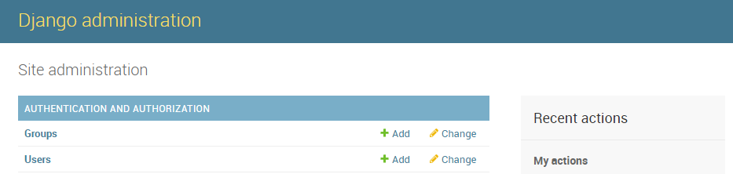
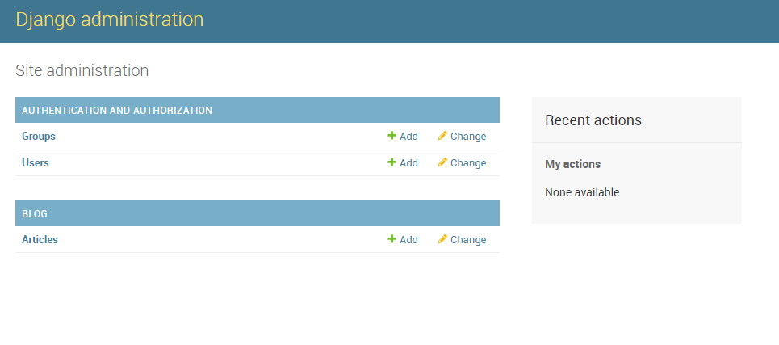
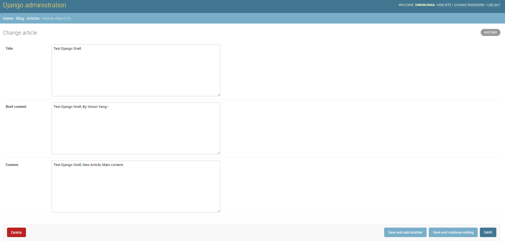
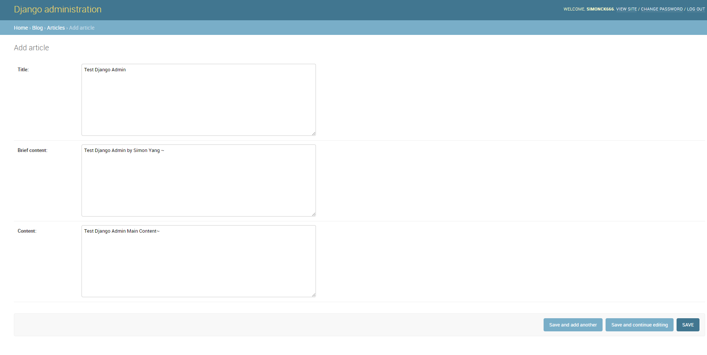

# Django Introduction

## Python 前端框架

1. Django
2. Flask
3. Tornado

## Django框架

- MVC框架模式：Model， View， Controller
- 开发效率高，让开发者能够迅速将想法实现
- 重视安全
- 功能强大

## Django Project

1. Django基本命令
- django-admin
> starproject #创建一个项目<br>startapp #创建一个app<br>check<br>test<br>runserver
- 数据库相关
> makemigrations #创建模型变更的迁移文件<br> migrate #执行上一个命令创建的迁移文件<br> dumpdata #把数据库数据导出到文件<br> loaddata #把文件数据导入数据库

2. 创建一个Django项目

`django-admin startproject django_introduction(名称)`

## Django APP

`python manage.py startapp blog(名称)`

1. Django应用可以自己管理模型、视图、模板、路由和静态文件
2. Django项目可以包含一组配置和若干个Django应用

## Django HelloWorld

1. Django视图：用于产生内容的东西
> 在APP的 `view.py` 文件中编写 `hello world` 函数返回

```python
# ../blog/view.py

from django.shortcuts import render

from django.http import HttpResponse

# Create your views here.


def hello_world(request):
    return HttpResponse("Hello World")
```

2. Django路由：

> App 层面配置
```python
# ../blog/urls.py

# creat a file named urls.py
#!/usr/bin/env python
# -*- coding:utf-8 -*-

from django.urls import path, include

import blog.views

urlpatterns = [
    path('hello_world', blog.views.hello_world)
]

```

> Project 层面配置
```python
# django_introduction/urls.py

"""django_introduction URL Configuration

The `urlpatterns` list routes URLs to views. For more information please see:
    https://docs.djangoproject.com/en/2.0/topics/http/urls/
Examples:
Function views
    1. Add an import:  from my_app import views
    2. Add a URL to urlpatterns:  path('', views.home, name='home')
Class-based views
    1. Add an import:  from other_app.views import Home
    2. Add a URL to urlpatterns:  path('', Home.as_view(), name='home')
Including another URLconf
    1. Import the include() function: from django.urls import include, path
    2. Add a URL to urlpatterns:  path('blog/', include('blog.urls'))
"""
from django.contrib import admin
from django.urls import path, include

urlpatterns = [
    path('admin/', admin.site.urls),

    # Add the path of blog/
    path('blog/', include('blog.urls'))
]

```

3. 将 APP 添加到 **setting.py** 文件中

在 **setting.py** 文件中 --> `INSTALLED_APPS` --> ADD APPS

```python
# Application definition

INSTALLED_APPS = [
    'django.contrib.admin',
    'django.contrib.auth',
    'django.contrib.contenttypes',
    'django.contrib.sessions',
    'django.contrib.messages',
    'django.contrib.staticfiles',

    # myApp
    'blog.apps.BlogConfig',
]

```

4. Terminal

`python manage.py runserver`

> http://127.0.0.1:8000/blog/hello_world  --> output 'hello world'

## Django模型层

### 什么是模型层

- 位于Django视图层和数据库之间
- Python对象和数据库表之间转换

### 为什么要模型层

- 屏蔽不同数据库之间的差异
- 开发者更加专注于业务逻辑的开发
- 提供很多便捷工具有助于开发

### 模型层相关配置

```python
# ../django_introduction/setting.py

# Database
# https://docs.djangoproject.com/en/2.0/ref/settings/#databases

DATABASES = {
    'default': {
        'ENGINE': 'django.db.backends.sqlite3',  # 提供的驱动
        'NAME': os.path.join(BASE_DIR, 'db.sqlite3'), # 名字文件
    }
}

```

### 创建博客文章类型

1. 设计博客模型

- 文章标题
    - 文本类型
- 文章摘要
    - 文本类型
- 文章内容
    - 文本类型
- 唯一ID标记
    - Int数字类型（自增，主键）
- 发布日期
    - 日期类型

2. 模型层定义字段

- 数字类型： `IntegerField`
- 文本类型： `TextField`
- 日期类型： `DateTimeField`
- 自增： `AutoField`
- 主键定义： `primary_key`属性

```python
# ../blog/models.py

from django.db import models

# Create your models here.

class Article(models.Model):
    # 文章唯一ID
    article_id = models.AutoField(primary_key=True)
    # 文章标题
    title = models.TextField()
    # 文章摘要
    brief_content = models.TextField()
    # 文章主要内容
    content = models.TextField()
    # 文章发布日期
    publish_date = models.DateTimeField(auto_now=True)  # 默认以当前事件为发布日期

```

3. 模型的迁移：将模型保存至数据库中

> `python manage.py makemigrations` 生成一个迁移文件<br>
> Terminal：

```py
E:\python_basic\DjangoLearn\Django_introduction\django_introduction>python manage.py makemigrations
Migrations for 'blog':
  blog\migrations\0001_initial.py
    - Create model Article

```

> `python manage.py migrate`  运行迁移文件，将内容传入数据库

```py
E:\python_basic\DjangoLearn\Django_introduction\django_introduction>python manage.py migrate
Operations to perform:
  Apply all migrations: admin, auth, blog, contenttypes, sessions
Running migrations:
  Applying contenttypes.0001_initial... OK
  Applying auth.0001_initial... OK
  Applying admin.0001_initial... OK
  Applying admin.0002_logentry_remove_auto_add... OK
  Applying contenttypes.0002_remove_content_type_name... OK
  Applying auth.0002_alter_permission_name_max_length... OK
  Applying auth.0003_alter_user_email_max_length... OK
  Applying auth.0004_alter_user_username_opts... OK
  Applying auth.0005_alter_user_last_login_null... OK
  Applying auth.0006_require_contenttypes_0002... OK
  Applying auth.0007_alter_validators_add_error_messages... OK
  Applying auth.0008_alter_user_username_max_length... OK
  Applying auth.0009_alter_user_last_name_max_length... OK
  Applying blog.0001_initial... OK
  Applying sessions.0001_initial... OK

```

## Django Shell

### Django Shell是什么

- Python Shell， 用于交互式的Python编程
- Django Shell， 类似，继承Django项目环境

### 为什么需要Django Shell

- 临时性操作使用 Django Shell 更加方便
- 小范围 Debug 更简单，不需要运行整个项目来测试

### 使用 Django Shell 新建一篇文章

> 进入 Django Shell 环境<br>
> Terminal：

`python manage.py shell`

```py
E:\python_basic\DjangoLearn\Django_introduction\django_introduction>python manage.py shell
Python 3.8.2 (tags/v3.8.2:7b3ab59, Feb 25 2020, 23:03:10) [MSC v.1916 64 bit (AMD64)] on win32
Type "help", "copyright", "credits" or "license" for more information.
(InteractiveConsole)
>>>

```

> 使用 Django Shell 新建一篇文章

```py

>>> from blog.models import Article   # 引入文章模型
>>> a = Article()   # 新建一篇文章
>>> a.title = 'Test Django Shell'
>>> a.brief_content = 'Test Django Shell, By Simon Yang~'
>>> a.content = 'Test Django Shell, New Article, Main content.'
>>>
>>> print(a)
Article object (None)
>>> a.save()   # 将文章 a 保存到数据库
>>>
>>> articles = Articles.objects.all()   # 查找数据库中所有文章
>>> article = articles[0]   # 找到第一篇文章
>>> 
>>> print(article.title)   # 打印出来这篇文章的 title
Test Django Shell
>>> print(article.brief_content)
Test Django Shell, By Simon Yang~
>>>

```

## Django Admin 模块

### Django Admin 是什么

- Django 的后台管理工具
- 读取定义的模型元数据， 提供强大的管理使用界面

### 为什么需要 Django Admin 模块

- Django Shell 新增文章太复杂了
- 管理页面是基础设施中重要的部分
- 认证用户、显示管理模型、校验输入等功能类似

### Django Admin 模块的使用

- 创建管理员用户
- 登陆页面进行管理

> Terminal:

```py
# 创建超级管理员用户

E:\python_basic\DjangoLearn\Django_introduction\django_introduction>python manage.py createsuperuser
Username (leave blank to use 'lenovo'): #####
Email address: ######
Password:
Password (again):
Superuser created successfully.
```

```py

E:\python_basic\DjangoLearn\Django_introduction\django_introduction>python manage.py runserver
Performing system checks...


# In Google Chome : http://127.0.0.1:8000/admin/login/?next=/admin/

```



- 将创建的文章模板添加到 Admin 中

```python
# ../blog/admin.py


from django.contrib import admin

# Register your models here.

from .models import Article

admin.site.register(Article)

```







## 显示 Article Title 的函数

```python
# ../bolg/models.py

# Show the articles' titles

    def __str__(self):
        return self.title

```

# 实战：实现博客数据的返回

